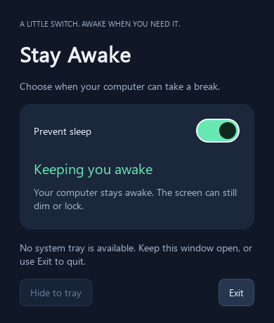

# Stay Awake

A small Windows, Linux and macOS widget with one switch to prevent automatic
idle sleep. A shared Qt interface uses each OS's native sleep inhibitor through
[wakepy](https://wakepy.readthedocs.io/stable/user-guide.html).



- **Switch on:** prevent automatic sleep while the app runs. The display may
  still turn off and the screen may still lock.
- **Switch off:** release the inhibitor; normal system idle sleep settings apply.
- **Close the window:** keep running in the Windows notification area, Linux
  panel or macOS menu bar. Click the icon or choose **Open Stay Awake** to reopen.
- **Exit in the tray menu** (or the window): release prevention and completely
  quit. Power settings are never changed. Each launch starts with prevention off.
- Launching a second copy reopens the existing window.

## Run from source

Use Python 3.10 or newer (3.12 recommended).

Windows PowerShell:

```powershell
py -3.12 -m venv .venv
.\.venv\Scripts\python -m pip install -e ".[dev]"
.\.venv\Scripts\python -m stay_awake
```

On this development machine, the working environment is `.venv312`; use
`.\.venv312\Scripts\python -m stay_awake` to run the source directly.

Linux / macOS:

```sh
python3 -m venv .venv
.venv/bin/python -m pip install -e '.[dev]'
.venv/bin/python -m stay_awake
```

You can also use the installed `stay-awake` command. No administrator access
is required. On Windows, `pythonw -m stay_awake` starts without a console.

## Build distributable apps

Build **on the target OS**; PyInstaller does not cross-compile.

```sh
python -m PyInstaller --noconfirm StayAwake.spec
```

Use the virtual environment's Python. Windows produces
`dist/StayAwake/StayAwake.exe`; Linux produces `dist/StayAwake/StayAwake`;
macOS produces `dist/StayAwake.app`. Distribute the **whole** Windows/Linux
folder, including `_internal`, rather than only the executable. The macOS
bundle is unsigned; signing/notarization is needed for frictionless public
distribution. CPU architecture matches the build machine.

The GitHub Actions workflow tests and builds all three platforms when pushed
to a GitHub repository, or when run manually. Downloads appear as workflow
artifacts.

## Platform behavior

| OS | Sleep prevention | Tray |
| --- | --- | --- |
| Windows | `SetThreadExecutionState` | Notification area; icon may be in the overflow menu |
| macOS | `caffeinate` | Menu bar |
| Linux | GNOME SessionManager or freedesktop PowerManagement D-Bus inhibition | StatusNotifierItem / XEmbed tray |

Linux requires a desktop implementing one of the supported D-Bus inhibitors.
GNOME may need the AppIndicator extension to display the tray icon. Without
a tray, closing keeps the window accessible and **Exit** remains available.
Unsupported inhibition produces an error and leaves the switch off.
Qt may require distro-specific X11/Wayland runtime libraries; on Ubuntu,
install `libxcb-cursor0`, `libxkbcommon-x11-0` and `libegl1` if Qt reports missing
platform libraries.

This app prevents **automatic idle sleep**. Explicit Sleep, closing a laptop
lid, critical battery actions and administrator policies may still suspend the
computer. After release, the OS decides when to sleep using its existing idle
policy; it need not sleep immediately.

## Verify

```sh
python -m pytest -q
```

Tests cover inhibitor ownership/release, activation failure, synchronized GUI
and tray controls, close-to-tray, tray absence and explicit exit. On each target
desktop, also check switch on → close → reopen → switch off → Exit, and confirm
idle behavior using your own sleep timeout. Headless CI does not prove actual
sleep behavior or tray integration on that OS.
